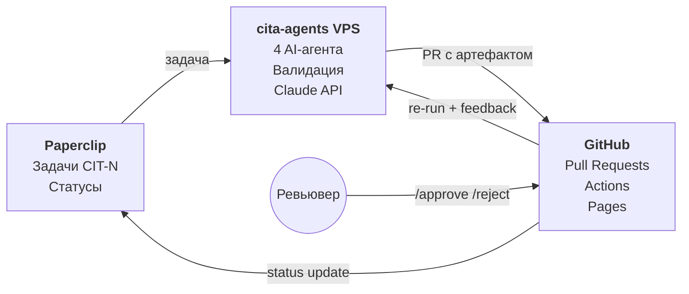
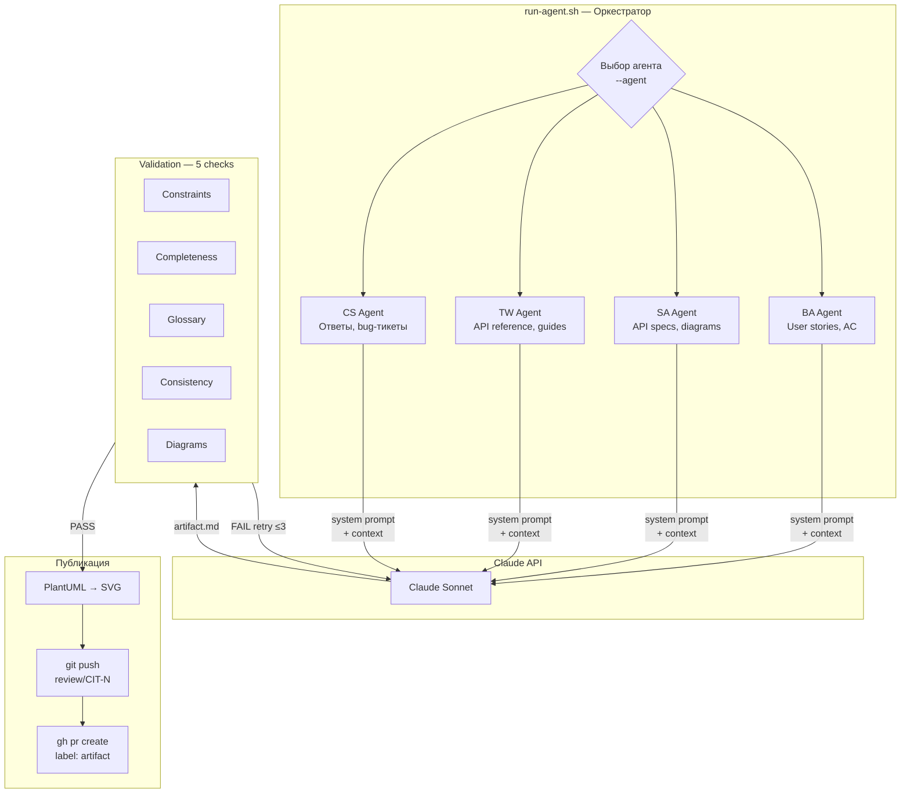
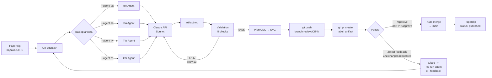
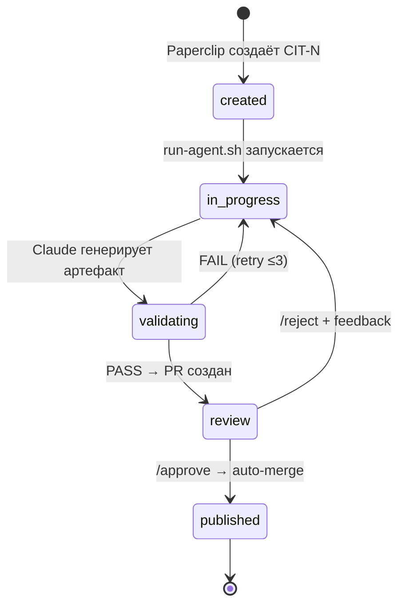

# cita-agents

4 AI-агента, которые генерируют проектную документацию для [cita.kz](https://cita.kz) (онлайн-запись в салоны красоты, Казахстан, Telegram Mini App).

**Проблема:** документация отстаёт от кода. User stories, API-спеки, гайды и ответы саппорта пишутся вручную, медленно и несогласованно.

**Решение:** агенты генерируют артефакты через Claude API, автоматически валидируют их по бизнес-правилам и глоссарию, создают PR для ревью. Ревьювер пишет `/approve` или `/reject <фидбэк>` — агент либо публикует, либо переделывает.

## Ссылки

| | |
|---|---|
| **Документация** | [anurgaz.github.io/cita-agents](https://anurgaz.github.io/cita-agents) |
| **Основной продукт** | [github.com/anurgaz/cita](https://github.com/anurgaz/cita) |
| **Задачи** | [Paperclip — проект CIT](https://app.paperclip.co) |
| **AI Model** | Claude Sonnet (Anthropic API) |

## Архитектура

Система состоит из 3 компонентов: Paperclip (задачи), VPS (агенты), GitHub (ревью + документация).



### Внутренняя архитектура VPS



## Workflow агентов



## Жизненный цикл задачи



## Агенты

| Агент | Роль | Артефакты | Зона |
|-------|------|-----------|------|
| **BA** | Business Analyst | User stories, AC (Given/When/Then), бизнес-сценарии | "Что нужно сделать?" |
| **SA** | System Analyst | API specs, sequence diagrams (PlantUML), test cases | "Как реализовать?" |
| **TW** | Technical Writer | API reference, how-to guides, changelog | "Как работает сейчас?" |
| **CS** | Customer Support | Ответы клиентам, bug-тикеты, эскалации | "Как использовать?" |

## Быстрый старт

### Требования
- bash 4+, curl, jq
- `ANTHROPIC_API_KEY` в переменных окружения
- `gh` CLI (для PR-операций)
- `plantuml` + Java (для рендеринга диаграмм)

### Запуск агента

```bash
# BA: создать user story
./pipeline/run-agent.sh \
  --agent ba \
  --task "User story: клиент хочет отменить запись через Mini App" \
  --context docs/business-rules/booking-rules.md docs/business-rules/cancellation-rules.md

# SA: спроектировать API
./pipeline/run-agent.sh \
  --agent sa \
  --task "API спека для DELETE /api/v1/bookings/{id}" \
  --context docs/data/data-dictionary.md docs/integrations/telegram-bot.md

# TW: написать guide
./pipeline/run-agent.sh \
  --agent tw \
  --task "How-to guide: как подключить Telegram-уведомления" \
  --context docs/integrations/telegram-bot.md \
  --mode post-deploy

# CS: ответить клиенту
./pipeline/run-agent.sh \
  --agent cs \
  --task "Клиент: 'Не могу записаться, нет свободных слотов'" \
  --context docs/business-rules/scheduling-rules.md
```

### Параметры run-agent.sh

| Параметр | Обязательный | Описание |
|----------|:---:|----------|
| `--agent` | да | Тип агента: `ba`, `sa`, `tw`, `cs` |
| `--task` | да | Текст задачи |
| `--context` | нет | Дополнительные .md файлы для контекста |
| `--mode` | нет | Режим работы (для TW: `post-deploy`) |
| `--feedback` | нет | Фидбэк ревьювера (при повторном запуске) |

### Результат

1. Артефакт генерируется через Claude API (Sonnet)
2. Автоматическая валидация (5 проверок)
3. PlantUML диаграммы рендерятся в SVG
4. Создаётся PR в ветку `review/CIT-N` с лейблом `artifact`
5. Ревьювер проверяет и пишет `/approve` или `/reject <фидбэк>`

## Валидация

5 автоматических проверок перед созданием PR:

| Проверка | Скрипт | Что делает |
|----------|--------|-----------|
| Constraints | `constraints-check.sh` | Артефакт ссылается на C-NNN, BR-NNN, SR-NNN |
| Completeness | `completeness-check.sh` | Все обязательные поля шаблона заполнены |
| Glossary | `glossary-check.sh` | Термины из glossary.md, нет запрещенных синонимов |
| Consistency | `consistency-check.sh` | Нет конфликтов с business-rules |
| Diagrams | `diagram-check.sh` | Flowchart/ER→Mermaid, Sequence/C4→PlantUML |

## GitHub Actions

### `/approve` — Artifact Approved
```
PR approve или комментарий /approve
  → Auto-merge PR в main
  → Paperclip: status = published
```

### `/reject <фидбэк>` — Artifact Rejected
```
PR changes_requested или комментарий /reject <текст>
  → Close PR
  → Re-run agent с --feedback
  → Новый PR создаётся автоматически
```

## Структура проекта

```
cita-agents/
├── agents/                       # Профили и промпты агентов
│   ├── ba-agent/                 # Business Analyst
│   ├── sa-agent/                 # System Analyst
│   ├── tw-agent/                 # Technical Writer
│   └── cs-agent/                 # Customer Support
│
├── docs/                         # Контекстная документация
│   ├── context/                  # glossary, constraints, tech-stack
│   ├── business-rules/           # BR-NNN, SR-NNN, NR-NNN, CR-NNN
│   ├── integrations/             # Telegram Bot, Mini App, 2GIS
│   ├── data/                     # Data dictionary, ER-диаграмма
│   ├── templates/                # Шаблоны артефактов
│   ├── examples/                 # Эталонные примеры
│   └── artifacts/                # Сгенерированные артефакты
│       ├── user-stories/
│       ├── api-specs/
│       ├── how-to-guides/
│       └── .images/              # Rendered PlantUML SVGs
│
├── validation/                   # Скрипты валидации (5 checks)
├── pipeline/                     # Оркестрация (run-agent.sh)
├── .github/workflows/            # GitHub Actions (approve/reject/deploy)
└── output/                       # Временные результаты
```

## Стек

| Компонент | Технология |
|-----------|-----------|
| AI Model | Claude Sonnet (Anthropic API) |
| Orchestration | Bash (run-agent.sh) |
| Task Management | [Paperclip](https://paperclip.co) |
| Code Review | GitHub Pull Requests |
| CI/CD | GitHub Actions |
| Documentation | MkDocs Material + GitHub Pages |
| Diagrams | Mermaid (flowchart, ER) + PlantUML (sequence, C4) |

## Контекст проекта

**cita.kz** — сервис онлайн-записи для салонов красоты Казахстана.

- **Backend:** FastAPI, SQLAlchemy 2.0 async, PostgreSQL 16, ClickHouse
- **Frontend:** React 19, Vite, Tailwind, shadcn/ui
- **Mini App:** Next.js 16, Zustand, Telegram WebApp SDK
- **Интеграции:** Telegram Bot API (webhook), 2GIS Suggest API, reCAPTCHA v3
- **Репозиторий:** [github.com/anurgaz/cita](https://github.com/anurgaz/cita)
