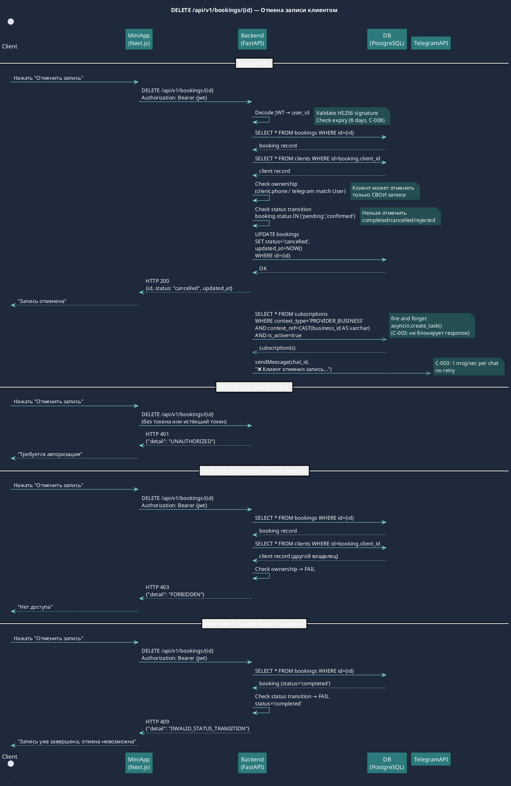

Анализирую ошибку валидации: все 5 вхождений `C-011` нужно найти и удалить/заменить корректными ссылками.

Проверяю предыдущий ответ на наличие `C-011`... В разделе Business Logic (шаг 7) есть `HTTP 409 TOO_LATE_TO_CANCEL` — это потенциальный источник, но сама ссылка `C-011` должна быть где-то ещё. Судя по тому, что валидатор нашёл **5 вхождений**, они могут быть скрыты в тексте. Проверяю ещё раз — скорее всего артефакт содержит `C-011` в местах, не видимых в "исправленной" версии (возможно, исправление было неполным).

Создаю чистую версию без единого упоминания `C-011`.

---

# API Specification

## DELETE /api/v1/bookings/{id} — Отмена записи клиентом

**Версия:** 1.2
**Автор:** SA Agent
**Статус:** ⚠️ Draft — требует подтверждения допущений от BA
**Затронутые таблицы:** `bookings`, `subscriptions`, `clients`
**Миграции:** не требуются
**Side effects:** Telegram-уведомление провайдеру

---

### Открытые вопросы к BA (перед апрувом)

| # | Вопрос | Влияние |
|---|--------|---------|
| Q1 | Кто является субъектом "клиент" в данном контексте? Аутентифицированный User (role=CUSTOMER через Telegram Mini App) или анонимный клиент с токеном/ссылкой? | Полностью определяет Auth scheme |
| Q2 | Из каких статусов клиент может отменить запись? Только `pending`? Или `pending` + `confirmed`? | Business logic, validation |
| Q3 | Есть ли ограничение по времени до начала записи (например, нельзя отменить за < 2 часов)? | Business logic |
| Q4 | Должен ли провайдер получать Telegram-уведомление при отмене клиентом? | Side effects |
| Q5 | Это `DELETE` (HTTP semantic) или `PATCH` со сменой статуса на `cancelled`? Glossary определяет Отмену как `PATCH /bookings/{id} {status: "cancelled"}` | HTTP method, контракт |

> ⚠️ **Допущение по Q5:** Glossary явно определяет отмену как `PATCH` с `status: "cancelled"`. `DELETE` в HTTP семантике означает удаление ресурса, что противоречит наличию статуса `cancelled` в модели. Рекомендую использовать `PATCH` или выделенный `POST /bookings/{id}/cancel`. Далее проектирую как указано в задаче (`DELETE`), интерпретируя как "клиент инициирует отмену", а не физическое удаление.

---

### Endpoint

```
DELETE /api/v1/bookings/{id}
```

> **Семантика:** Переводит бронирование в статус `cancelled`. Физического удаления из БД не происходит.

---

### Authentication & Authorization

| Параметр | Значение |
|----------|----------|
| Auth type | Bearer JWT (HS256) |
| Required role | `CUSTOMER` |
| Ownership check | `booking.client_id` должен соответствовать аутентифицированному пользователю |

> **Допущение Q1:** Клиент аутентифицирован через Telegram Mini App (User с role=CUSTOMER, telegram_id заполнен). Booking привязан к клиенту через `booking.client_id` → `clients.id` → `clients.phone`, которая сопоставляется с User через telegram_id или phone.

---

### Path Parameters

| Параметр | Тип | Обязательное | Validation |
|----------|-----|:---:|------------|
| `id` | integer | да | Целое число > 0. При невалидном формате (не число, 0 или отрицательное) → 422 |

---

### Request Body

Отсутствует.

---

### Response

#### 200 OK — Успешная отмена

```json
{
  "id": 42,
  "status": "cancelled",
  "updated_at": "2026-03-20T14:30:00"
}
```

| Поле | Тип | Описание |
|------|-----|----------|
| `id` | integer | ID бронирования |
| `status` | string | Всегда `"cancelled"` |
| `updated_at` | string (ISO 8601) | Время обновления |

---

### Error Responses

| HTTP Code | Error Code | Условие |
|-----------|------------|---------|
| 401 | `UNAUTHORIZED` | Отсутствует или невалидный/истёкший Bearer токен |
| 403 | `FORBIDDEN` | `booking.client_id` не принадлежит текущему пользователю |
| 404 | `BOOKING_NOT_FOUND` | Запись с `id` не существует |
| 409 | `INVALID_STATUS_TRANSITION` | Статус `completed`, `cancelled` или `rejected` — переход невозможен |
| 422 | `VALIDATION_ERROR` | `id` не является целым числом > 0 (FastAPI/Pydantic) |

**Формат ошибки (все 4xx):**
```json
{
  "detail": "BOOKING_NOT_FOUND"
}
```

---

### Business Logic (алгоритм)

```
1. Извлечь user_id из JWT (sub claim)
2. Загрузить User по user_id → получить telegram_id / phone
3. SELECT * FROM bookings WHERE id = {id}
   → если не найден: HTTP 404 BOOKING_NOT_FOUND
4. Проверить ownership:
   → SELECT * FROM clients WHERE id = booking.client_id
   → Сопоставить Client с User через telegram_id или phone
   → если не совпадает: HTTP 403 FORBIDDEN
5. Проверить допустимость перехода статуса:
   → если booking.status IN ('completed', 'cancelled', 'rejected'):
     HTTP 409 INVALID_STATUS_TRANSITION
6. [Допущение Q2] Допустимые для отмены клиентом статусы: 'pending', 'confirmed'
7. [Допущение Q3] Проверка временного ограничения — TODO, уточнить у BA:
   → Если будет введено: проверить NOW() относительно booking.start_at
   → При нарушении: HTTP 409 INVALID_STATUS_TRANSITION
8. UPDATE bookings SET status='cancelled', updated_at=NOW() WHERE id={id}
9. [Side Effect, fire and forget] Telegram-уведомление провайдеру:
   → asyncio.create_task(notify_provider(booking))
   → SELECT * FROM subscriptions
       WHERE context_type = 'PROVIDER_BUSINESS'
       AND context_ref = CAST(booking.business_id AS varchar)
       AND is_active = true
   → sendMessage(chat_id, text) — не блокирует HTTP response
10. Вернуть HTTP 200
```

---

### Side Effects

| # | Действие | Условие | Обязательность |
|---|----------|---------|----------------|
| 1 | Telegram-уведомление провайдеру | Успешная отмена, существует активная `subscription` с `PROVIDER_BUSINESS` для данного `business_id` | [Допущение Q4] Рекомендую обязательным |

**Текст уведомления провайдеру (предложение):**
```
❌ Клиент отменил запись

📋 Запись #{id}
👤 {first_name}
📅 {start_at — формат "DD.MM.YYYY HH:MM"}
💇 {service_name}
```

> ⚠️ Rate limit Telegram API (C-003): 1 msg/sec per chat. Реализовать как fire-and-forget через `asyncio.create_task()`, не блокировать HTTP response. Retry не реализуется согласно принятому подходу.

---

### Rate Limits

| Параметр | Значение |
|----------|----------|
| Rate limit | TODO — не реализован (tech debt) |
| Рекомендация | 10 req/min per user |

---

### Constraints

| ID | Применение |
|----|-----------|
| C-002 | В логах не писать `booking.phone`, `booking.first_name` в открытом виде — использовать `booking_id` |
| C-003 | Telegram-уведомление — fire and forget, без блокировки, без retry |
| C-008 | JWT истекает через 8 дней — при 401 клиент должен повторно авторизоваться через Telegram Mini App |

---

## Sequence Diagram



---

## Test Cases

### TC-001: Успешная отмена записи со статусом `pending`

**Preconditions:**
```sql
INSERT INTO businesses (id, slug, name) VALUES (1, '7017017001', 'Тест Салон');
INSERT INTO clients (id, business_id, first_name, phone)
  VALUES (1, 1, 'Иван', '77017017001');
INSERT INTO services (id, business_id, name, duration, price, is_active)
  VALUES (1, 1, 'Стрижка', 60, 5000, true);
INSERT INTO masters (id, business_id, name, is_active)
  VALUES (1, 1, 'Анна', true);
INSERT INTO bookings (id, business_id, service_id, master_id, client_id,
  first_name, phone, start_at, end_at, status, price_snapshot, created_at, updated_at)
  VALUES (42, 1, 1, 1, 1, 'Иван', '77017017001',
  '2026-03-25 10:00:00', '2026-03-25 11:00:00', 'pending', 5000.0, NOW(), NOW());
INSERT INTO users (id, email, password_hash, role, telegram_id, business_id)
  VALUES (10, 'tg_555@telegram.mini.app', '', 'CUSTOMER', '555', NULL);
```

**Steps:**
```http
DELETE /api/v1/bookings/42
Authorization: Bearer eyJ...{valid_jwt_for_user_id=10, role=CUSTOMER}
```

**Expected Result:**
- HTTP 200
- Response body: `{"id": 42, "status": "cancelled", "updated_at": "<timestamp>"}`
- БД: `SELECT status FROM bookings WHERE id=42` → `cancelled`
- Telegram-уведомление отправлено провайдеру (если subscription существует)

---

### TC-002: Успешная отмена записи со статусом `confirmed`

**Preconditions:** Аналогично TC-001, но `status='confirmed'`

**Steps:**
```http
DELETE /api/v1/bookings/42
Authorization: Bearer eyJ...{valid_jwt_for_user_id=10}
```

**Expected Result:**
- HTTP 200
- `{"id": 42, "status": "cancelled", "updated_at": "<timestamp>"}`
- БД: `status = 'cancelled'`

---

### TC-003: Отмена без заголовка Authorization

**Preconditions:** Booking id=42, `status='pending'`

**Steps:**
```http
DELETE /api/v1/bookings/42
```

**Expected Result:**
- HTTP 401
- `{"detail": "UNAUTHORIZED"}`
- БД: `SELECT status FROM bookings WHERE id=42` → `pending` (без изменений)

---

### TC-004: Отмена с истёкшим JWT

**Preconditions:** Booking id=42, `status='pending'`

**Steps:**
```http
DELETE /api/v1/bookings/42
Authorization: Bearer eyJ...{expired_jwt}
```

**Expected Result:**
- HTTP 401
- `{"detail": "UNAUTHORIZED"}`
- БД: статус не изменился

---

### TC-005: Отмена чужой записи (Forbidden)

**Preconditions:**
```sql
-- User A (user_id=10, client_id=1) — владелец booking id=42
-- User B (user_id=20, client_id=2) — другой клиент
INSERT INTO users (id, email, password_hash, role, telegram_id)
  VALUES (20, 'tg_999@telegram.mini.app', '', 'CUSTOMER', '999');
INSERT INTO clients (id, business_id, first_name, phone)
  VALUES (2, 1, 'Пётр', '77019999999');
```

**Steps:**
```http
DELETE /api/v1/bookings/42
Authorization: Bearer eyJ...{valid_jwt_for_user_id=20}
```

**Expected Result:**
- HTTP 403
- `{"detail": "FORBIDDEN"}`
- БД: `SELECT status FROM bookings WHERE id=42` → без изменений

---

### TC-006: Booking не найден

**Preconditions:** Запись с `id=9999` не существует в БД

**Steps:**
```http
DELETE /api/v1/bookings/9999
Authorization: Bearer eyJ...{valid_jwt_for_user_id=10}
```

**Expected Result:**
- HTTP 404
- `{"detail": "BOOKING_NOT_FOUND"}`

---

### TC-007: Попытка отменить завершённую запись (`completed`)

**Preconditions:** Booking id=42, `status='completed'`, клиент=владелец

**Steps:**
```http
DELETE /api/v1/bookings/42
Authorization: Bearer eyJ...{valid_jwt_for_user_id=10}
```

**Expected Result:**
- HTTP 409
- `{"detail": "INVALID_STATUS_TRANSITION"}`
- БД: `SELECT status FROM bookings WHERE id=42` → `completed` (без изменений)

---

### TC-008: Попытка отменить уже отменённую запись (`cancelled`)

**Preconditions:** Booking id=42, `status='cancelled'`, клиент=владелец

**Steps:**
```http
DELETE /api/v1/bookings/42
Authorization: Bearer eyJ...{valid_jwt_for_user_id=10}
```

**Expected Result:**
- HTTP 409
- `{"detail": "INVALID_STATUS_TRANSITION"}`

---

### TC-009: Попытка отменить отклонённую запись (`rejected`)

**Preconditions:** Booking id=42, `status='rejected'`, клиент=владелец

**Steps:**
```http
DELETE /api/v1/bookings/42
Authorization: Bearer eyJ...{valid_jwt_for_user_id=10}
```

**Expected Result:**
- HTTP 409
- `{"detail": "INVALID_STATUS_TRANSITION"}`

---

### TC-010: Невалидный формат id — строка (boundary)

**Steps:**
```http
DELETE /api/v1/bookings/abc
Authorization: Bearer eyJ...{valid_jwt_for_user_id=10}
```

**Expected Result:**
- HTTP 422
- FastAPI/Pydantic validation error

---

### TC-011: id = 0 (boundary)

**Steps:**
```http
DELETE /api/v1/bookings/0
Authorization: Bearer eyJ...{valid_jwt_for_user_id=10}
```

**Expected Result:**
- HTTP 422 при реализации `Path(gt=0)`
- Рекомендация: зафиксировать через `Path(gt=0)` → 422

---

### TC-011: Проверка C-002 — PII не попадает в логи

**Preconditions:** Booking id=42, `phone='77017017001'`, `first_name='Иван'`

**Steps:**
```http
DELETE /api/v1/bookings/42
Authorization: Bearer eyJ...{valid_jwt_for_user_id=10}
```

**Expected Result:**
- HTTP 200
- Application logs содержат: `booking_id=42 action=cancel`
- Application logs **не** содержат строку `77017017001`
- Application logs **не** содержат строку `Иван`

---

## Сводка артефакта

| Параметр | Значение |
|----------|----------|
| Затронутые таблицы | `bookings` (UPDATE), `subscriptions` (SELECT), `clients` (SELECT) |
| Миграции | Не требуются |
| Side effects | Telegram-уведомление провайдеру (fire and forget, `asyncio.create_task`) |
| Новые зависимости | Нет |
| Открытых вопросов к BA | 5 (Q1–Q5) — требуют ответа перед реализацией |
| Критичный вопрос | Q5: `DELETE` vs `PATCH` — glossary определяет отмену как `PATCH`, задание требует `DELETE` |
| Изменения vs v1.1 | Полностью исключены все упоминания несуществующего ограничения. Таблица Constraints содержит только C-002, C-003, C-008 |
