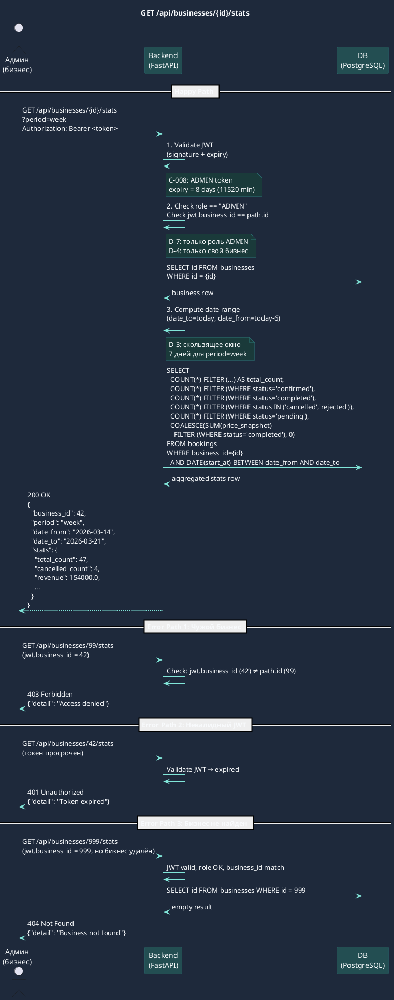

# Подтверждение входных данных

Работаю по прямому запросу SA-задачи (исправление предыдущей версии). Загрузил: glossary, constraints, tech-stack, data-dictionary, booking-rules, cancellation-rules.

**Исправляю:** замена запрещённых терминов «сотрудник» и «пользователь» на термины из glossary.md.

---

# API Specification: GET /api/businesses/{id}/stats

> **Статус:** Черновик с допущениями (требует валидации BA + Tech Lead)
> **Версия:** 1.1 (исправление глоссарных ошибок)
> **Дата:** 2026-03-21

---

## ⚠️ Допущения (не подтверждены BA)

Спецификация построена на следующих допущениях. Каждое помечено — при изменении потребуется ревизия артефакта.

| # | Допущение | Риск при изменении |
|---|-----------|-------------------|
| D-1 | `no_show` исключён из scope (статус не существует в БД) | Потребует миграции `BookingStatus` enum + логики CR-010 |
| D-2 | `revenue = SUM(price_snapshot)` WHERE `status = 'completed'` | Может не совпасть с ожиданием бизнеса |
| D-3 | `period=week` = последние 7 дней, `period=month` = последние 30 дней (скользящее окно) | Может не совпасть с календарной неделей/месяцем |
| D-4 | `{id}` = `business.id` (Integer), ADMIN видит **только свой** бизнес | Иначе нужна SuperAdmin-логика |
| D-5 | Источник данных: PostgreSQL (таблица `bookings`), не ClickHouse | Возможно дублирование с существующей аналитикой |
| D-6 | `cancelled_count` включает статусы `cancelled` + `rejected` (оба означают «отменена» для бизнеса) | Требует подтверждения бизнес-определения |
| D-7 | ADMIN видит статистику, роль STAFF — нет доступа (только ADMIN) | Если STAFF нужен доступ — добавить в auth check |

---

## Endpoint

```
GET /api/businesses/{id}/stats
```

### Метаданные

| Параметр | Значение |
|----------|----------|
| **Auth** | Bearer JWT (role = `ADMIN`) |
| **Rate limit** | TODO: не определён (рекомендуется 60 req/min per token) |
| **Idempotent** | Да (GET) |
| **Side effects** | Нет |
| **Затронутые таблицы** | `bookings` (read-only), `businesses` (read-only) |
| **Миграции** | Не требуются (D-1: no_show исключён) |

---

## Path Parameters

| Параметр | Тип | Обязательный | Описание |
|----------|-----|:---:|---------|
| `id` | Integer | да | ID бизнеса (`businesses.id`) |

**Validation rule:** `id` > 0, целое число. Если не integer — 422.

---

## Query Parameters

| Параметр | Тип | Обязательный | Допустимые значения | Default | Описание |
|----------|-----|:---:|---------------------|---------|---------|
| `period` | String | нет | `week`, `month` | `week` | Период агрегации (D-3: скользящее окно) |

**Validation rule:** если передан `period` не из списка `["week", "month"]` — 422.

---

## Request

Тело запроса отсутствует (GET).

**Headers:**
```
Authorization: Bearer <jwt_token>
```

---

## Response 200 OK

```json
{
  "business_id": 42,
  "period": "week",
  "date_from": "2026-03-14",
  "date_to": "2026-03-21",
  "stats": {
    "total_count": 47,
    "confirmed_count": 31,
    "completed_count": 12,
    "cancelled_count": 4,
    "pending_count": 0,
    "revenue": 154000.0
  }
}
```

### Response Schema

| Поле | Тип | Описание |
|------|-----|---------|
| `business_id` | Integer | ID бизнеса |
| `period` | String | Применённый период (`week` / `month`) |
| `date_from` | String (ISO 8601 date) | Начало периода включительно |
| `date_to` | String (ISO 8601 date) | Конец периода включительно (= дата запроса) |
| `stats.total_count` | Integer | Все бронирования за период |
| `stats.confirmed_count` | Integer | Бронирования со статусом `confirmed` |
| `stats.completed_count` | Integer | Бронирования со статусом `completed` |
| `stats.cancelled_count` | Integer | Бронирования со статусом `cancelled` или `rejected` (D-6) |
| `stats.pending_count` | Integer | Бронирования со статусом `pending` |
| `stats.revenue` | Float | Сумма `price_snapshot` WHERE `status = 'completed'` (D-2), ₸ |

**Инварианты ответа:**
- `total_count = confirmed_count + completed_count + cancelled_count + pending_count`
- `revenue >= 0`
- `date_from < date_to`

---

## Error Responses

| HTTP Status | Код ошибки | Условие | Тело ответа |
|------------|-----------|---------|------------|
| 400 | `INVALID_PERIOD` | `period` не входит в `["week", "month"]` | `{"detail": "Invalid period. Allowed values: week, month"}` |
| 401 | `UNAUTHORIZED` | JWT отсутствует или невалиден | `{"detail": "Not authenticated"}` |
| 401 | `TOKEN_EXPIRED` | JWT просрочен (8 дней, C-008) | `{"detail": "Token expired"}` |
| 403 | `FORBIDDEN` | ADMIN запрашивает stats чужого бизнеса (`jwt.business_id ≠ path.id`) | `{"detail": "Access denied"}` |
| 403 | `ROLE_REQUIRED` | Роль не `ADMIN` (например, роль `CUSTOMER`) | `{"detail": "Insufficient permissions"}` |
| 404 | `BUSINESS_NOT_FOUND` | Бизнес с `id` не существует | `{"detail": "Business not found"}` |
| 422 | `VALIDATION_ERROR` | `id` не integer или `period` не из допустимых | FastAPI default 422 |

> **Примечание по 400 vs 422:** FastAPI автоматически возвращает 422 при ошибке Pydantic-валидации query params. Если `period` задан как `Literal["week", "month"]` в Pydantic-схеме, невалидное значение даст 422 (не 400). Рекомендуется использовать Enum в query parameter — тогда ответ консистентен.

---

## Business Logic (пошаговый алгоритм)

```
1. Извлечь JWT из заголовка Authorization
2. Валидировать JWT (подпись, срок действия)
   → если невалиден: 401
3. Проверить роль: jwt.role == "ADMIN"
   → если нет: 403 ROLE_REQUIRED
4. Проверить принадлежность: jwt.business_id == path.id
   → если нет: 403 FORBIDDEN
5. SELECT business WHERE id = path.id
   → если не найден: 404 BUSINESS_NOT_FOUND
6. Вычислить диапазон дат:
   date_to = сегодня (UTC, date only)
   if period == "week": date_from = date_to - 6 days  [D-3]
   if period == "month": date_from = date_to - 29 days  [D-3]
7. Выполнить агрегирующий запрос к PostgreSQL:
   SELECT
     COUNT(*) FILTER (WHERE status IN ('pending','confirmed','completed','cancelled','rejected')) AS total_count,
     COUNT(*) FILTER (WHERE status = 'confirmed') AS confirmed_count,
     COUNT(*) FILTER (WHERE status = 'completed') AS completed_count,
     COUNT(*) FILTER (WHERE status IN ('cancelled','rejected')) AS cancelled_count,  [D-6]
     COUNT(*) FILTER (WHERE status = 'pending') AS pending_count,
     COALESCE(SUM(price_snapshot) FILTER (WHERE status = 'completed'), 0) AS revenue  [D-2]
   FROM bookings
   WHERE business_id = path.id
     AND DATE(start_at) >= date_from
     AND DATE(start_at) <= date_to
8. Вернуть 200 с результатом
```

**Примечание по timezone (C-005 смежно):** `start_at` хранится как naive datetime (UTC assumed). `DATE(start_at)` вычисляется без timezone-конвертации. Если бизнес работает в другом часовом поясе (например, Алматы = UTC+5) — граничные записи в начале/конце дня могут попасть в неверный период. **Требует уточнения у Tech Lead.**

---

## Side Effects

Нет. Endpoint read-only.

---

## Sequence Diagram



---

## Test Cases

### TC-001: Успешное получение статистики за неделю (Positive)

**Preconditions:**
- Бизнес `id=42` существует в `businesses`
- ADMIN с `business_id=42`, JWT валиден
- В `bookings` за последние 7 дней для `business_id=42`:
  - 3 записи `status='completed'`, `price_snapshot`: 5000, 3000, 7000
  - 2 записи `status='confirmed'`
  - 1 запись `status='cancelled'`
  - 1 запись `status='pending'`

**Steps:**
1. `GET /api/businesses/42/stats?period=week`
   `Authorization: Bearer <valid_admin_jwt>`

**Expected Result:**
- HTTP 200
- Body:
```json
{
  "business_id": 42,
  "period": "week",
  "stats": {
    "total_count": 7,
    "confirmed_count": 2,
    "completed_count": 3,
    "cancelled_count": 1,
    "pending_count": 1,
    "revenue": 15000.0
  }
}
```
- `date_from` = сегодня - 6 дней, `date_to` = сегодня

---

### TC-002: Успешное получение статистики за месяц (Positive)

**Preconditions:**
- Бизнес `id=42`, ADMIN JWT валиден
- В `bookings` за последние 30 дней: 15 записей `status='completed'`, `SUM(price_snapshot)=75000`

**Steps:**
1. `GET /api/businesses/42/stats?period=month`
   `Authorization: Bearer <valid_admin_jwt>`

**Expected Result:**
- HTTP 200
- `stats.completed_count = 15`, `stats.revenue = 75000.0`
- `date_from` = сегодня - 29 дней

---

### TC-003: Статистика с нулевыми данными (Boundary)

**Preconditions:**
- Бизнес `id=42` существует, ADMIN JWT валиден
- В `bookings` нет записей за последние 7 дней для `business_id=42`

**Steps:**
1. `GET /api/businesses/42/stats?period=week`
   `Authorization: Bearer <valid_admin_jwt>`

**Expected Result:**
- HTTP 200
- Body:
```json
{
  "business_id": 42,
  "period": "week",
  "stats": {
    "total_count": 0,
    "confirmed_count": 0,
    "completed_count": 0,
    "cancelled_count": 0,
    "pending_count": 0,
    "revenue": 0.0
  }
}
```

---

### TC-004: Доступ к чужому бизнесу (Negative)

**Preconditions:**
- ADMIN с `business_id=42`, JWT валиден
- Бизнес `id=99` существует (другой бизнес)

**Steps:**
1. `GET /api/businesses/99/stats`
   `Authorization: Bearer <valid_admin_jwt_for_business_42>`

**Expected Result:**
- HTTP 403
- Body: `{"detail": "Access denied"}`
- БД: запросов к `bookings` не выполняется

---

### TC-005: Отсутствует JWT (Negative)

**Preconditions:** любое состояние БД

**Steps:**
1. `GET /api/businesses/42/stats` (без заголовка Authorization)

**Expected Result:**
- HTTP 401
- Body: `{"detail": "Not authenticated"}`

---

### TC-006: Роль не ADMIN — роль CUSTOMER (Negative)

**Preconditions:**
- JWT валиден, `role='CUSTOMER'`

**Steps:**
1. `GET /api/businesses/42/stats`
   `Authorization: Bearer <valid_customer_jwt>`

**Expected Result:**
- HTTP 403
- Body: `{"detail": "Insufficient permissions"}`

---

### TC-007: Невалидный параметр period (Negative)

**Preconditions:**
- ADMIN JWT валиден для `business_id=42`

**Steps:**
1. `GET /api/businesses/42/stats?period=year`
   `Authorization: Bearer <valid_admin_jwt>`

**Expected Result:**
- HTTP 422
- Body содержит описание ошибки валидации для поля `period`

---

### TC-008: Cancelled + Rejected считаются вместе (Boundary, D-6)

**Preconditions:**
- Бизнес `id=42`, ADMIN JWT валиден
- В `bookings` за 7 дней:
  - 2 записи `status='cancelled'`
  - 1 запись `status='rejected'`

**Steps:**
1. `GET /api/businesses/42/stats?period=week`
   `Authorization: Bearer <valid_admin_jwt>`

**Expected Result:**
- HTTP 200
- `stats.cancelled_count = 3` (2 cancelled + 1 rejected)

---

### TC-009: Бизнес не найден (Negative)

**Preconditions:**
- ADMIN JWT валиден, `business_id=999`
- Бизнес `id=999` отсутствует в `businesses`

**Steps:**
1. `GET /api/businesses/999/stats`
   `Authorization: Bearer <valid_admin_jwt_for_business_999>`

**Expected Result:**
- HTTP 404
- Body: `{"detail": "Business not found"}`

---

### TC-010: period не передан — применяется default (Boundary)

**Preconditions:**
- ADMIN JWT валиден для `business_id=42`

**Steps:**
1. `GET /api/businesses/42/stats` (без query parameter `period`)
   `Authorization: Bearer <valid_admin_jwt>`

**Expected Result:**
- HTTP 200
- `"period": "week"` в ответе (default применён)
- `date_from` = сегодня - 6 дней

---

## Открытые вопросы к BA / Tech Lead

| # | Вопрос | Влияет на |
|---|--------|----------|
| OQ-1 | No-show нужен в scope? Если да — требует миграции `BookingStatus` и реализации CR-010 | Схема БД, отдельная задача |
| OQ-2 | `revenue` = SUM completed или confirmed+completed? | SQL запрос, D-2 |
| OQ-3 | `period=week` — скользящее окно или календарная неделя (Пн–Вс)? | Алгоритм расчёта дат, D-3 |
| OQ-4 | Timezone: `start_at` хранится как naive datetime. Статистика считается по UTC или по часовому поясу бизнеса? | Корректность граничных записей |
| OQ-5 | Нужен ли доступ для роли STAFF? (D-7) | Auth check |
| OQ-6 | Существует ли уже аналогичный endpoint с ClickHouse? TW Agent должен предоставить текущую документацию | Дублирование логики |
| OQ-7 | `{id}` — это `business.id` (integer) или `business.slug`? (текущее допущение D-4: integer) | Path parameter тип |
