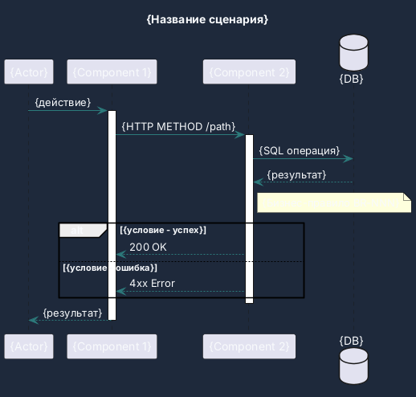
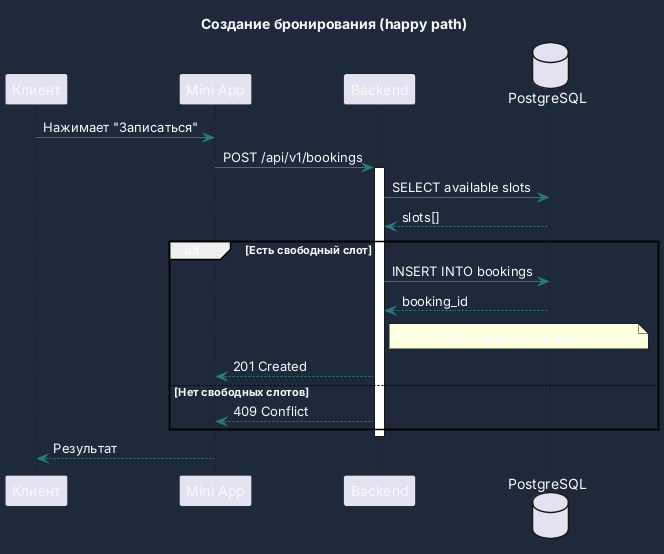

# Sequence Diagram Template (SA Agent, PlantUML)

## Инструкция для агента

1. Используй **PlantUML** синтаксис для sequence diagram
2. Участники (participants) — именуй по архитектурным компонентам: Client, MiniApp, Backend, DB, TelegramAPI, 2GIS
3. Каждый вызов — указывай HTTP method + path или SQL-операцию
4. Группируй логику через `alt`, `opt`, `loop`, `group`
5. Добавляй `note` для бизнес-правил (ссылки BR-NNN, SR-NNN)
6. Диаграмма должна соответствовать API spec (API-NNN)

> **Правило выбора формата:**
> - Sequence diagram, C4 → PlantUML
> - Flowchart, ER diagram → Mermaid

---

## Шаблон

```markdown
# SEQ-{NNN}: {Название сценария}

## Meta
- **Агент-автор:** SA
- **User Story:** US-{NNN}
- **API Spec:** API-{NNN}
- **Дата:** {YYYY-MM-DD}

## Описание
{1-2 предложения о сценарии}

## Диаграмма



## Примечания (опционально)
- {Дополнительные пояснения}
```

---

## Мини-пример


