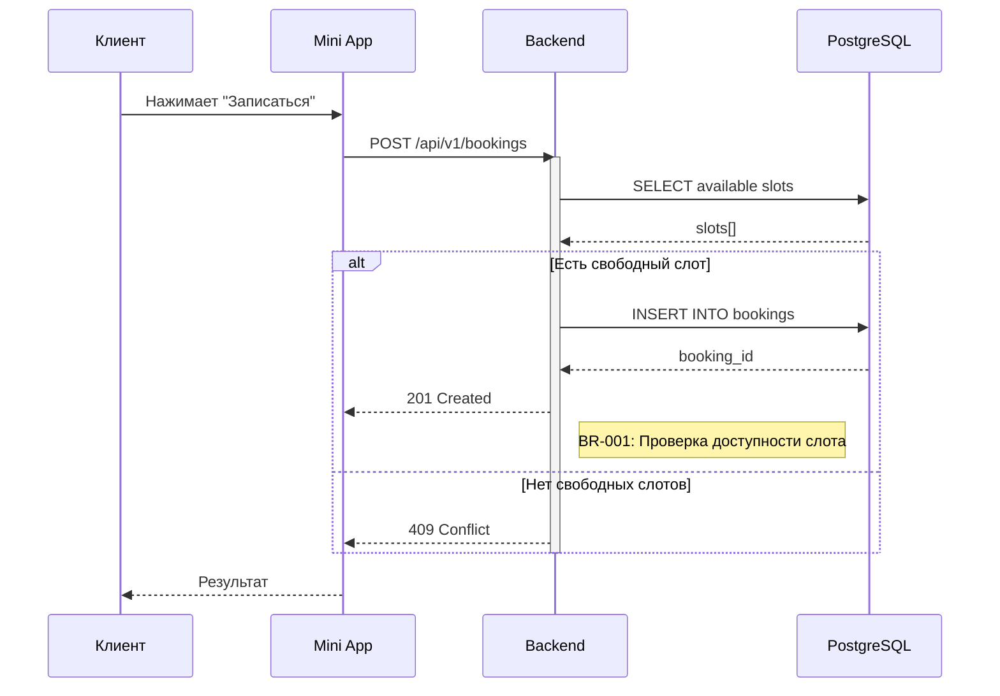

# Sequence Diagram Template (SA Agent, Mermaid)

## Инструкция для агента

1. Используй **Mermaid** синтаксис (НЕ PlantUML)
2. Участники (participants) — именуй по архитектурным компонентам: Client, MiniApp, Backend, DB, TelegramAPI, 2GIS
3. Каждый вызов — указывай HTTP method + path или SQL-операцию
4. Группируй логику через `alt`, `opt`, `loop`, `rect`
5. Добавляй `Note` для бизнес-правил (ссылки BR-NNN, SR-NNN)
6. Диаграмма должна соответствовать API spec (API-NNN)

---

## Шаблон

```markdown
# SEQ-{NNN}: {Название сценария}*

## Meta
- **Агент-автор:** SA
- **User Story:** US-{NNN}*
- **API Spec:** API-{NNN}*
- **Дата:** {YYYY-MM-DD}*

## Описание
{1-2 предложения о сценарии}

## Диаграмма

```mermaid
sequenceDiagram
    participant Actor as {Actor}
    participant C1 as {Component 1}
    participant C2 as {Component 2}
    participant DB as {DB}

    Actor->>C1: {действие}
    activate C1

    C1->>C2: {HTTP METHOD /path}
    activate C2

    C2->>DB: {SQL операция}
    DB-->>C2: {результат}

    Note right of C2: {Бизнес-правило BR-NNN}

    alt {условие - успех}
        C2-->>C1: 200 OK
    else {условие - ошибка}
        C2-->>C1: 4xx Error
    end

    deactivate C2
    C1-->>Actor: {результат}
    deactivate C1
```

## Примечания (опционально)
- {Дополнительные пояснения}
```

---

## Мини-пример



## Синтаксис Mermaid Sequence Diagram

### Типы стрелок
- `A->>B: text` — синхронный вызов (сплошная линия)
- `A-->>B: text` — ответ (пунктирная линия)
- `A-)B: text` — асинхронный вызов

### Группировка
- `alt / else / end` — условие
- `opt / end` — опциональный блок
- `loop / end` — цикл
- `rect rgb(50, 50, 50) / end` — прямоугольная группа

### Заметки
- `Note right of A: текст` — заметка справа
- `Note left of A: текст` — заметка слева
- `Note over A,B: текст` — заметка между участниками

### Активация
- `activate A` / `deactivate A`
- Или `A->>+B: call` / `B-->>-A: response`
