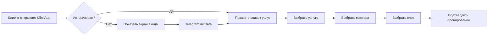
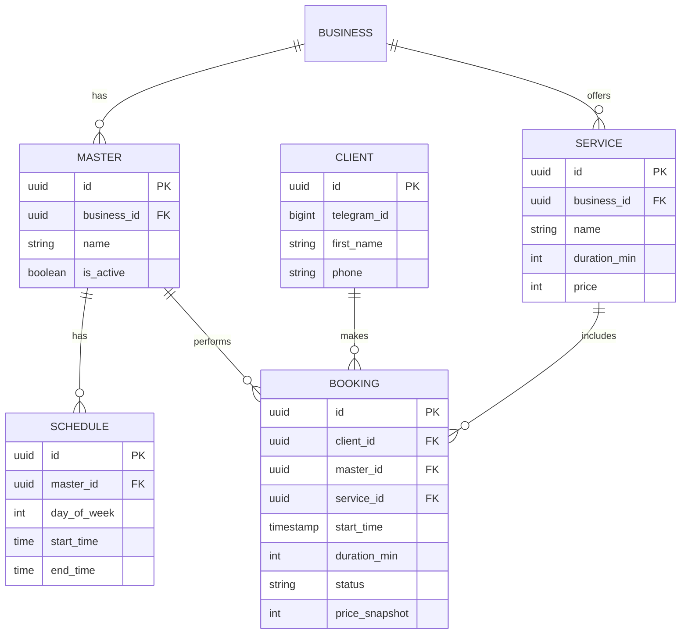
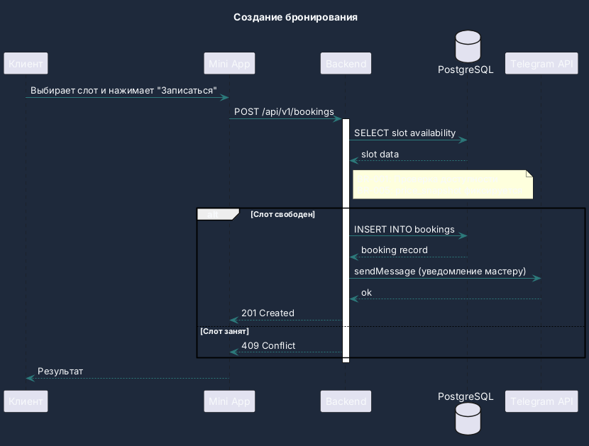
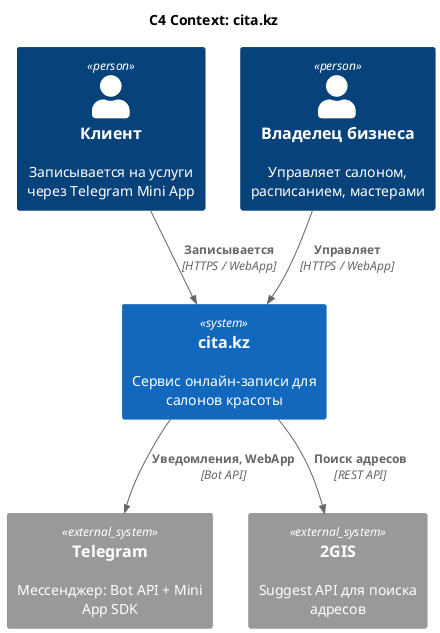

# Test Diagrams

Тестовый файл: 4 диаграммы в правильных форматах.

## 1. Flowchart (Mermaid)

## 2. ER Diagram (Mermaid)

## 3. Sequence Diagram (PlantUML)

## 4. C4 Context Diagram (PlantUML)

